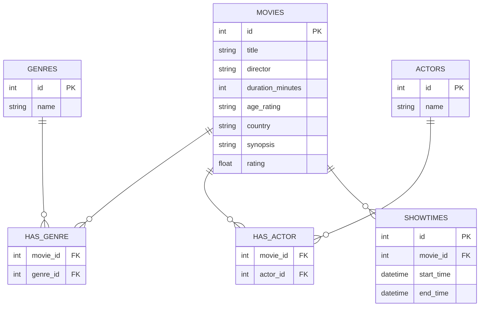

# cinema-etl-pipeline
Automated ETL pipeline that scrapes local cinema showtimes, cleans the data, and loads it into a relational database on a daily schedule, with a stack including Python, BeautifulSoup, pandas and SQLAlchemy.

## Database schema

## Project structure

- `scraper.py` — fetches raw HTML from a given URL, with a browser
  User-Agent, a request timeout, and error handling for both connection
  failures and non-200 status codes.
- `parser.py` — parses the raw HTML into a list of movie dictionaries
  using BeautifulSoup. Fields with a fixed position (title, director,
  cast, rating, showtimes) are extracted directly; fields with variable
  position (country, genre, duration, age rating) are classified by
  shape/membership rather than by index.
- `constants.py` — known-value catalogs (countries, genres) used to
  classify the variable-position fields by membership instead of by
  process of elimination.
- `transformer.py` — cleans and transforms the parsed data using pandas.
  Missing fields are kept as explicit nulls rather than filled with
  default values. Duration is converted to a numeric type, showtimes are
  converted to real datetimes using the execution date, and end_time is
  derived from duration and start_time.
- `models.py` — SQLAlchemy ORM models translating the ER schema into
  Python classes: `Genre`, `Actor`, `Movie`, `Showtime`, and the junction
  tables `HasGenre` and `HasActor` (with composite primary keys for the
  N:M relationships). Uses SQLite as the underlying engine for
  portability; switching to PostgreSQL would only require changing the
  connection string in `database.py`.
- `database.py` — connects to a SQLite database via SQLAlchemy's engine
  and Session, creates the tables from `models.py`, and provides
  `upsert_movie` (update-if-exists / insert-if-new), `add_showtime`
  (always inserts, since each session on each day is a distinct record),
  and get-or-create + link helpers for genres and actors, avoiding
  duplicate rows in the junction tables.